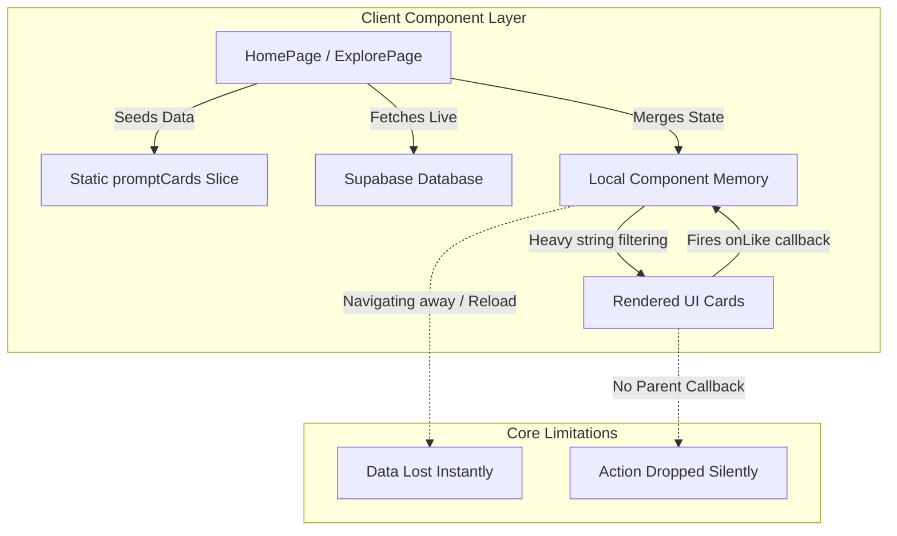

# Production-Readiness & Implementation Audit Report
**Project:** PromptNeko Marketplace  
**Target Architecture:** Next.js (App Router), React 19, Supabase, Tailwind CSS  
**Audit Objective:** Comprehensive code and implementation assessment identifying mocked UI components, state persistence gaps, security vulnerabilities, and architectural bottlenecks prior to production deployment.

---

## Executive Summary

PromptNeko exhibits an exceptionally high-fidelity, visually arresting frontend interface that effectively communicates a premium design language. However, beneath the polished presentation lies a fundamentally decoupled architecture predominantly driven by static data slices, localized component state, and unimplemented UI wrappers. 

While core database migration pathways have been initialized—demonstrated by working user authentication syncs, dynamic prompt creation pipelines, and direct database queries for administrative dashboard management—over **70% of interactive user workflows** (such as bookmarking, liking, analytics tracking, file uploads, and checkout flows) act purely as visual demos. To achieve genuine production readiness, the platform must bridge the massive delta between client-side state simulators and deterministic backend persistence structures.

---

## Production Readiness Score

  <h1 style="font-size: 48px; margin-bottom: 0; color: #ff4f9d;">35 / 100</h1>
  
<strong>Status: Critical Refactoring Required Prior to Launch</strong>

| Evaluation Dimension | Score | Assessment Overview |
| :--- | :---: | :--- |
| **UI/UX Visual Fidelity** | **85 / 100** | Exceptional aesthetics, micro-interactions, responsive frameworks, and polished styling tokens. |
| **Backend Persistence Layer** | **20 / 100** | Core ingestion routes exist, but critical relationship tables (likes, saves, purchases) are entirely absent or mocked. |
| **State Caching & Data Flow** | **25 / 100** | High memory usage due to inline client-side text filtering; optimistic UI updates drop changes on navigation. |
| **Security & Safety Controls** | **25 / 100** | Dev-mode admin bypass endpoints remain accessible; API endpoints lack rate-limiting and robust input sanitization. |
| **Realtime Infrastructure** | **10 / 100** | Complete lack of live synchronization across client sessions; notifications and metrics are static placeholders. |

---

## 1. Fake / Demo-Only Features Deep Dive

### A. Static Metrics & Engagement Counters
* **Current Behavior:** Metrics displayed on prompt detail views, sidebar cards, and homepage hero counters (`158K+ Prompts`, `12.4K Creators`, `2.1M Users`) are directly injected via static strings or read from hardcoded mock objects (`prompt.stats.views`).
* **Why it fails production:** Static engagement numbers completely destroy platform credibility. View counters do not record true impressions, providing creators with zero accurate analytics regarding layout performance.
* **Implementation Gap:** Atomic database increments triggered via optimized RPC invocations on detail view render, coupled with Redis or Supabase Realtime event streaming for real-time dashboard updates.

### B. Client-Isolated Bookmarking and Like Logic
* **Current Behavior:** In components like `ExplorePage.tsx` and `LikedPage.tsx`, liking or saving an entity mutates a local React `useState` array/Set containing string IDs. Clicking the like icon applies a CSS transition color shift.
* **Why it fails production:** Liking a prompt persists exclusively within the current browser runtime memory. Navigating to an alternate route or triggering a full window reload purges all active selections instantly. Furthermore, `HomePage.tsx` renders `PromptCard` without passing the `onLike` callback, rendering the home interface buttons dead on click.
* **Implementation Gap:** Dedicated Supabase junction tables (`user_likes` and `user_saved_prompts`), authenticated API mutation routes, and global state synchronization leveraging SWR or React Query cache invalidation.

### C. Placeholder Action Drawer Workflows
* **Current Behavior:** Clicking CTA buttons such as *"Buy Prompt"*, *"Try this prompt"*, or secondary navigation toggles spawns an overlay drawer (`ActionDrawer.tsx`) pre-filled with demo text reading: *"This control is wired and ready for the production route or modal behind {action}."*
* **Why it fails production:** Simulates operational complexity without executing functional intent. Users are blocked from completing the core transactional conversions intended by the marketplace model.
* **Implementation Gap:** Fully configured Stripe API dynamic checkout sessions, database transaction logs confirming asset ownership permissions, and secure pre-signed delivery tokens.

### D. Disconnected Media Thumbnail Picker
* **Current Behavior:** Within `PromptMedia.tsx`, the primary asset displays properly, but the secondary thumbnail strip renders 6 arbitrary items derived from `promptCards` static constants. Clicking secondary thumbnails does not update the primary layout display frame.
* **Why it fails production:** Frustrates user inspection workflows; items appear clickable but lack event hooks entirely.
* **Implementation Gap:** Dynamic mapping of `prompt_assets` relational arrays mapped to an interactive parent state index controlling the active media frame.

### E. Static Reviews Panel
* **Current Behavior:** Hardcoded inline string arrays populate customer quotes in `ReviewsPanel.tsx`. The component itself is disabled and commented out inside `PromptDetailPage.tsx`.
* **Why it fails production:** Leaves a major conversion engine (social proof) entirely offline while adding dead code weight to the source tree.
* **Implementation Gap:** Relational `reviews` table indexing verified buyer feedback with server component rendering.

---

## 2. Feature-by-Feature Completeness Matrix

| Feature Module | Current Status | Architectural Classification | Notes & Gaps |
| :--- | :--- | :--- | :--- |
| **Authentication** | Partially Implemented | Hybrid (Supabase SSR + Cookies) | Sessions sync correctly via middleware rotation, but missing robust UI recovery states for expired cookies. |
| **Authorization** | Partially Implemented | Client Effects / Server Verification | DB RLS rules exist, but client views rely on inline effects rather than secure layout wrapper boundaries. |
| **CRUD: Prompts** | Partially Implemented | Server Action Ingestion | Dynamic creation API functions perfectly; editing/deleting existing entries via user UI stops at local prop propagation. |
| **Search & Filter** | Partially Implemented | Hybrid Client / Query Params | Query params map back to initial state, but core filtering runs costly string inclusion lookups inside client bundles. |
| **Upload Systems** | Mock / Demo | Client String Allocation | Assets are saved as flat URL strings; zero chunking or multi-part validation with physical storage buckets. |
| **Comments & Reviews**| Stub / Disabled | Hardcoded Client Strings | Static arrays inside detached files; absent database insertion routes or verification flags. |
| **Notifications** | UI Only | CSS Overlay Elements | Static alert indicators; lacks database tracking schema or socket integration. |
| **Realtime Sync** | Absent | Non-existent | Zero live updates across active user sessions. |
| **Analytics** | Stub / Demo | Static Dashboard UI | Charts and counters present fixed, placeholder values. |
| **Settings / Config** | UI Only | Local Toggle Traps | Controls flip local UI classes without invoking user metadata mutations. |
| **User Profiles** | Partially Implemented| DB Queries for Auth Prompts | Renders creator products via real Supabase queries, but editing profile copy or public profile navigation is unhooked. |
| **Admin Control** | Partially Implemented| Secure Server RPC calls | Admin assignment routes connect to real databases, but dev test functions open critical unauthorized exploitation vectors. |
| **Payments Layer** | UI Only | Trigger Drawer Simulators | Models pricing attributes, but drops users into placeholder drawers rather than Stripe verification layers. |
| **API Proxy Service** | Stub / Demo | Text-only Storage | Prompts are stored as strings without parameter testing integration or real proxying to LLM providers. |

---

## 3. Data Flow & State Management Review

### Current Architectural Flows
The UI structures operate primarily as monolithic Client Components that ingest hardcoded base maps, trigger supplementary side-effect calls to fetch public rows, and concatenate the arrays. State filtering relies on heavy localized `useMemo` hooks running recursive multi-string checks across all prompt text attributes.

### Core Architecture Weaknesses
1. **Prop Drilling & Callback Blindspots:** Parent elements inject raw static handlers downward. If an intermediate layout wrapper (e.g., `HomePage`) forgets to pass an `onLike` parameter, child button clicks fire into empty space without throwing runtime warnings.
2. **Volatile Local Storage:** Storing critical relationship data (`saved`, `liked`) inside React container state ensures guaranteed data loss upon navigation transitions.
3. **Redundant Client Filtering Overhead:** Executing complex regex and substring lookups inside standard React render pipelines degrades frames-per-second (FPS) metrics and spikes client CPU utilization when collections scale past 100 entities.

### Recommended Data Flow Pattern
Adopt **Server-Driven Data Normalization** via React Server Components (RSC) integrated with robust caching tools (SWR or TanStack Query):
* Move prompt query hydration entirely to server layouts.
* Isolate client side actions to small, decoupled optimistic mutation hooks that update persistent local cache layers instantly while executing non-blocking background server actions to ensure true database reconciliation.

---

## 4. Backend Integration Audit

### Critical Integration Gaps
* **Missing API Handlers:** Secure pre-signed image/video upload URL generators, dynamic user profile field updates, transactional webhook confirmation listeners, and authentic user follow state toggles.
* **Simulated Service Implementations:** The fallback mechanisms embedded inside `app/actions/categories.ts` intercept failed DB fetch routines and silently inject static template arrays, masking core infrastructure disconnects from monitoring dashboards.

### Component Credibility Breakdown
* **Pretending to Work (UI Demonstrators):**
  * `PromptCard.tsx` action icon toolbars on the primary Landing View.
  * `RightRail.tsx` sidebar filtering item selectors.
  * `PromptSidebar.tsx` transactional purchase execution logic.
  * `ActionDrawer.tsx` action response modals.
* **Functioning Interfaces (True Backend Sync):**
  * `CreatePromptPage.tsx` multi-step submission API interactions.
  * `AdminPage.tsx` verification review approvals and status updating logic.
  * `ProfilePage.tsx` personal data query population.

---

## 5. Database & Persistence Review

### Persistence Audit
* **Fully Persisted States:** User Auth Identity generation, Prompt Row object insertions, Administrative state flags (`status`, `is_featured`, `category_id`).
* **Ephemeral Client States:** Custom collection parameters, prompt search strings, item bookmark metrics, profile configuration metrics.

### Database Integrity Risks
* **Missing Junction Schemas:** Absence of structural tracking records (`user_purchases`, `creator_followers`, `prompt_reviews`) leaves the database fundamentally unequipped to handle production e-commerce operations.
* **Missing Indexing Opportunities:** Fetching queries execute raw sequence matches against broad string parameters (`title`) without utilizing highly optimized PostgreSQL `GIN` indexes or full-text vector searching structures, creating an immediate throughput bottleneck.

---

## 6. Production Readiness & Security Review

### A. Critical Security Vulnerabilities
> [!CAUTION]
> **Unauthorized Admin Escalation Endpoint**  
> **File:** `app/api/admin/make-me-admin/route.ts`  
> **Risk:** Exposes a public API endpoint executing service-role permissions to force-update any authenticated user's role column to `"admin"`. In a production environment, an automated web crawler or malicious user can hit this route and instantly seize administrative superuser control over the entire marketplace architecture.  
> **Remediation:** Completely strip this endpoint from the codebase or aggressively wrap execution logic inside strict Node environment checks (`process.env.NODE_ENV === 'development'`).

### B. Scalability Bottlenecks
* **Unbounded Database Pagination Ranges:** Ingestion queries (`fetchAllActivePrompts`) request ranges up to 500 rows simultaneously without enforcing hard upper memory limits, threatening backend server timeouts under multi-tenant load.
* **Memory Bloat:** Ingestion of massive Base64 design strings directly into standard string allocation memory spaces degrades application responsiveness over prolonged operational lifecycles.

### C. Missing Operational Safeguards
* **Missing Rate Limiting:** Public creation and API routes do not implement Redis-backed sliding window token buckets, leaving endpoints completely vulnerable to API request flooding and database write-exhaustion attacks.
* **Missing Input Sanitization:** Form entry handlers submit textual markdown and prompt content variables directly into the server stream without passing through robust filtering layers, exposing potential persistent Cross-Site Scripting (XSS) vectors.

---

## 7. Code Quality & Technical Debt Assessment

### Technical Debt Inventory
1. **Unused Imports & Dead Modules:** Remnants of legacy static layout prototypes (`ReviewsPanel.tsx`, fallback files) clutter the application directory structure.
2. **Hardcoded Domain Rules:** Explicit business variables (pricing models, tag constraints, category mappings) are hardcoded across client components rather than centralized within configuration environments.
3. **Massive Component Architectures:** Files such as `CategoriesPage.tsx` and `HomePage.tsx` exceed recommended complexity thresholds, interleaving complex UI elements, inline logic handlers, client effects, and mock allocation maps.
4. **Weak Interface Typing:** Server action response bodies frequently cast payload outputs to any (`as any`), destroying compile-time type confidence during client payload hydration workflows.

---

## 8. Prioritized Implementation & Refactor Roadmap

### Priority 1: Critical Security & Integrity Fixes
| Issue | Target Files | Root Cause | Remediation Plan | Est. Complexity |
| :--- | :--- | :--- | :--- | :---: |
| **Admin Privilege Escalation** | `api/admin/make-me-admin/route.ts` | Dev helper left in production tree | Remove file entirely or restrict execution to safe development variables. | **Low** |
| **Missing Rate Limiting** | `api/prompts/create/route.ts` | Open API surface | Wrap handlers with upstash-redis sliding window algorithms. | **Medium** |
| **Weak Entity Typing** | `lib/queries.ts` | Direct casting to `any` | Implement strong generated Supabase Database definitions across RPC responses. | **Medium** |

### Priority 2: Data Persistence Core Foundations
| Issue | Target Files | Root Cause | Remediation Plan | Est. Complexity |
| :--- | :--- | :--- | :--- | :---: |
| **Ephemeral Interaction States**| `ExplorePage.tsx`, `LikedPage.tsx` | Localized client memory arrays | Build `user_likes` SQL schemas; integrate optimistic UI TanStack query state syncs. | **High** |
| **Dead Prompt Action Hooks** | `HomePage.tsx`, `PromptCard.tsx` | Missing prop injections | Standardize component props; implement uniform global mutator bindings. | **Medium** |
| **Client-Side Filtering Bloat** | Core Pages | Inefficient multi-regex maps | Shift filtering logic to server search parameters backed by Postgres GIN indexing. | **High** |

### Priority 3: Feature Completeness Integration
| Issue | Target Files | Root Cause | Remediation Plan | Est. Complexity |
| :--- | :--- | :--- | :--- | :---: |
| **Dummy Action Drawer Workflows**| `ActionDrawer.tsx` | Demo placeholder elements | Connect primary payment intent CTAs to valid checkout endpoints. | **High** |
| **Static View Incrementing** | `PromptSidebar.tsx` | Hardcoded initialization constants | Build API route wrapping atomic Postgres increment RPC executions on page hit. | **Medium** |
| **Unlinked Thumb Galleries** | `PromptMedia.tsx` | Random slice mock values | Map layout preview arrays to actual `prompt_assets` relational tables. | **Medium** |

---

## Conclusion & Next Steps
The core UI elements of PromptNeko are highly attractive and provide an outstanding user experience. By systematically working through the prioritized refactoring roadmap—starting immediately with neutralizing open admin vulnerabilities and binding client side state logic to persistent database relationships—the platform can transition from a premium visual demonstrator into a fully scalable, secure, production-ready enterprise marketplace.
